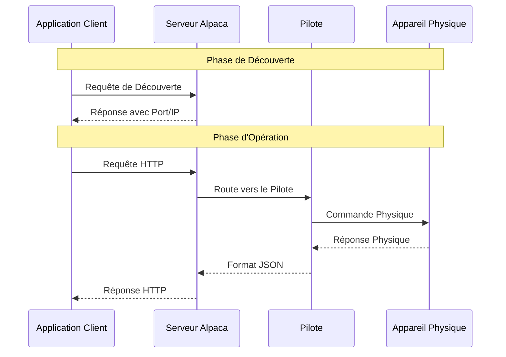

# Starget : Conception d'une monture astronomique
Ayant découvert l'astronomie, en tant qu'étudiant il y a quelques années, j'ai toujours été confronté aux limitations liées au budget. Débutant, mes exigences concernant les performances de mon matériel 
sont limitées. Ajoutant à cela mes études d'ingénieur et les compétences qui en découlent, il est tout naturel que je me sois tourné vers le DIY pour renforcer mon équipement.

Pour mieux comprendre la portée et le contexte du projet, il serait peut-être bien que je me présente : 
Je suis Sylvain BROCAS, élève ingénieur à l'École Centrale de Lyon et passioné de sciences et de techniques. Touche à tout, je suis toujours à la recherche de nouvelles compétences et 
de nouveaux défis, en particulier de projets mêlant mécanique, électronique et programmation. 
Converti à la fabuleuse passion qu'est l'astronomie en arrivant dans mon école, je me suis rapidement tourné vers l'astrophotographie. Le but de mes sessions d'observation nocturne consiste donc 
à repartir avec une image qui me satisfait. Au début de l'année 2024, j'étais déjà équipé avec un télescope (Un Arcane N180/1080 pour les connaisseurs), matériel performant mais lourd et encombrant. 
J'ai donc investit dans une monture plus légère, une Star Adventurer de chez SkyWatcher. C'est une bonne petite monture, motorisée sur un axe, et fiable... maiiss il me manquait un petit quelque chose.

*Votre serviteur sous la constellation d'Orion*

Pour ceux qui ne sont pas familiers avec ces termes techniques, voici un petit rappel :
- **L'astrophotographie** est une technique photographique qui consiste à prendre des photos du ciel nocturne, en particulier des étoiles et des planètes. 
Ce genre de photo demande de longs temps de pose (quelques secondes a plusieurs minutes pour 1 photo),
ce qui nécessite un dispositif de suivi assez rapidement.
- **Une monture** est un support qui permet de maintenir un télescope ou un appareil photo en mouvement, de manière à compenser la rotation de la Terre et permettre ces 
longs temps de pose. Elle peut être motorisée pour automatiser le suivi
- **Une monture Équatoriale** est un type de monture qui permet, après un phase de réglage (mise en station), de suivre un objet céleste en compensant la rotation de la 
Terre en utilisant un seul axe de rotation.
- **Un APN** est un Appareil Photo Numérique, un appareil photo classique type Reflex ou Hybride.

Ce que j'attends d'une monture comme la Star Adventurer, c'est de la portabilité, de la légèreté et un minimum de performances. Cependant, je trouve que pour son poids, elle ne permet pas de porter un gros ensemble optique, elle est trop lourde pour des petits trepieds légers comme un étudiant dans mon cas est capable de se payer. La mise en station peut être difficile parce que le montage est sensible aux vibrations... et les perofrmances de la monture dépendent fortement de la qualité de la mise en station. Rajoutons a cela qu'elle ne dispose pas de pointage automatique, cette monture est bonne, mais elle peut se révéler fastidieuse à utiliser.

Sa grande soeur, la [Star Adventurer GTi](http://www.skywatcher.com/product/star-adventurer-gti/) réponds à quelques problématiques mais coûte près de deux fois plus cher. J'ai donc décidé de me lancer dans la conception d'une monture équatoriale motorisée, qui répondrait à mes besoins et à mes contraintes. Je l'ai appelée **Starget**, contraction de Star et Target...je trouvais que ça matchait plutôt bien. 

> Mon objectif n'est pas de réinventer la roue ou de concurrencer les géants de l'astronomie, mais plutôt de concevoir une monture orientée vers l'ultra portabilité. Une monture assez spécialisée donc, dont le cadre d'utilisation se restreint principalement à de l'astrophotographie à l'APN, avec un objectif ou téléobjectif, avec un dispositif léger et robuste, qu'on peut facilement glisser dans un sac de voyage sans avoir à payer des bagages en plus.

Vous l'aurez compris, dans ce projet, les gros défis vont reposer dans l'optimisation du poids, de l'ergonomie et bien sûr du prix final du dispositif. Mais ce n'est pas tout | Une monture c'est également un assemblage de pièces mécaniques qui n'existent que dans mon esprit, de composants életroniques qu'il va falloir assembler intelligement, programmer afin d'obtemnir un Tout fonctionnel.

Je vous laisse plonger dans cette aventure avec moi, dans cet article, je vais vous amener avec moi dans la jungle que représente un tel projet. Sachez que je partage également régulièrement des nouvelles du projet sur notre [serveur discord](https://discord.com/invite/339KvZDSf7).

## Avant-propos
Comme dans tout projet, la première chose à faire, c'est de saisir un stylo, un papier (dans mon cas, un carnet entier ^^) et de poser au calme nos idées : 

Qu'est-ce que je veux faire ? *Une monture astronomique*. Très bien, mais qu'a-t-elle de spécial cette monture ? *Elle est très légère, on peut le mettre dans son sac sans la casser, et ah, on peut l'alimenter avec une batterie externe...
vu qu'on va l'utiliser dans les champs, à la montagne, *... Mais, au fait, existe-t-il déjà des montures similaires ? J'ai entendu parler d'Onstep par exemple.

> Onstep est un projet Open Source qui permet de motoriser une monture équatoriale facilement avec un micro-contrôleur et des drivers de moteurs pas-à-pas. C'est une solution très économique et très performante, mais assez mal documentée si l'on sort des composants classiques.

*Oui, effectivement, Onstep est une bonne solution à mon problème, ça m'évite d'avoir à recoder un logiciel complet, ça m'aide à choisir les coposants électroniques...reste plus qu'à développer la mécanique, et ça tombe bien, c'est ce que je préfère !*
**Mais ce serait passer à côté d'un aspect très important de ce projet : **je le vois comme un projet d'application, d'apprentissage. 
Je vais beaucoup bouger pendant la fin de mes études, j'ai déjà du matériel à la maison... Avoir cette monture entre les mains 
n'est pas urgent à mes yeux. De prendre le temps d'apprendre de nouvelles compétences, de me mettre au défi, de partager des 
ressources avec internet, en particulier des ressources francophones qui peuvent manquer parfois... C'est là mon véritable objectif 
derrière ce projet.

> En découvrant le projet, vous vous ferez peut-être parfois la reflexion que je fouille trop certains points, que je m'attarde sur des détails qui ne permettent pas de faire avancer le projet, mais gardez à l'esprit que j'y trouve sûrement un intérêt personnel derrière. N'hésitez en revanche pas à partager votre avis sur le projet, à me poser des questions, à me donner des conseils. La meilleure solution vient souvent des remarques les plus anodines.

## Étape 1 : Structurer le projet
Il est temps de passer pour de vrai au projet. Dans cete article, je vais rester assez général. D'autres articles viendrons pour expliquer en détail certains points techniques. Je vais aujorud'hui me contenter d'expliquer les grandes lignes du projet, les grandes étapes que je vais suivre pour arriver à mes fins.

> Une revue de projet sera (ou a été) diffusée sur notre chaîne Twitch justement pour présenter le projet et l'étudier un peu plus en profondeur.

### 1.1 : Cahier des charges
Le cahier des charges de ce projet va rester assez simple, dans la mesure où il va évoluer au fur et à mesure des mes découvertes. 
En effet, bein que déjà expérimenté en programmation, en conception, développer une monture est quelque chose d'assez particulier,
je n'ai pas vraiment d'expérience dans ce domaine, il il m'a fallu plusieurs mois d'explorations pour comprendre comment était structurée une monture,
quels étaient les composants comme les moteurs adaptés à cette application, quels outils existent déjà pour me faciliter la tâche sans tout réinventer.

---- CDC

### 1.2 : Planification
Je vois ce projet comme un projet à moyen terme, organisé en plusieurs étapes :

1. **Recherche et documentation :** C'est ce que j'ai fait pendant plusieurs mois. J'ai lu des articles, des forums, des 
documentations techniques, j'ai regardé des vidéos, des tutoriels... Cette étape est cruciale pour pouvoir placer le cursuer au bon endroit entre créér et réutiliser. Trop d'invention, 
c'est trop de travail, et c'est rrisque l'abandon, pas assez, ce serait passer à côté des mes objectifs
2. **Conception d'un premier prototype :** Cette version de la monture devra répondre au strict minimum des mes exigences 
*(A savoir, la motorisation et le pointage sur les deux axes de la monture, et les critères de performance dans le pire des cas de chargement)***
3. **Test et validation du prototype :** Cette étape est cruciale pour valider les choix de conception, les choix de composants, et les choix de programmation. C'est aussi l'occasion de valider les performances de la monture. À partir de ce stade, le projet prends une autre tournure. On a un système fonctionnel, et on peut maintenant s'amuser à le pousser, en ajoutant des fonctionnalités, en optimisant sa conception, en corrigeant surtout les problèmes de la première version.
4. **Finalisation du projet :** Cette étape est encore lointaine aujourd'hui. Ce projet a vocation aujourd'hui à rester ouvert. 
Il faudra adjoindre aux fichiers sources de la documentation, peut-être vendrai-je également des kits pré-montés...
Cette étape est encore lointaine aujourd'hui, mais il me faudra la préciser au cours du projet, en fonction de mon avancement et de l'intérêt que le projet suscite.

## Étape 2 : Comment on conçoit une monture ?
### 2.1 : La structure
Pour bien concevoir une monture, il faut d'abord comprendre comment elle fonctionne et ce qui la compose. Basiquement, quelque soit son architecture, une monture ce sont deux axes orthogonaux qui permettent de balayer toute la voûte céleste, et qui, dans notre cas, seront motorisés. Les moteurs, mais aussi les éventuels capteurs, connecteurs etc seront gérés automatiquement par une carte électronique, un genre d'unité centrale.

Je ne rentrerai pas dans le détail de toutes les architectures physiques de monture qui existent, je vous laisse un petit lien vers une une ressource assez exhaustive sur le sujet [ici](http://serge.bertorello.free.fr/optique/montures/montures.html). Sachez simplement que j'ai choisis une architecture de monture équatoriale.

### 2.2 : Utilisation d'une monture
Une monture s'utilise de la manière suivante : 
    - **Installation du matériel :** On place la monture sur son trepied, on la charge avec notre ensemble optique
    - **Mise en station (Si monture équatoriale) :** Sur certaines montures (dont Starget), il faut  aligner un axex de la monture avec la rotation de la Terre à travers une opération appelée mise en station
    - **Connecter la monture à un élément de contrôle :** Ce dernier, une fois connecté à la monture lui enverra les instructions et lui demandera son état (position, est-ce qu'elle bouge, ...). L'unité centrale doit ensuite convertir ces instructions "haut niveau" en instructions "bas niveau" pour les moteurs, les capteurs, ... 
    
> En règle générale, l'élément de contrôle est un logiciel PC, mais il peut aussi s'agir d'une application mobile ou d'une télécommande. Dans notre cas, le premier prototype sera pensé pour fonctionner avec le logiciel [NINA](https://nighttime-imaging.eu/), très répandu dans le monde de l'astronophotographie.

### 2.3 : La connexion avec l'élément de contrôle
Pour connecter la monture à l'élément de contrôle, il faut choisir un **protocole de communication**. Il en existe plusieurs dédiés à l'astronomie et supportés par quasiment tous les logiciels de contrôle de monture, j'ai choisis de travailler avec une solution qui s'appelle **Alpaca, développé par ASCOM**, grand nom du domaine.

Alpaca est un protocole de communication qui permet de contrôler des équipements astronomiques à distance, via par exemple un réseau local, mais qui a aussi la particularité d'être multiplateforme. Cela signifie que le driver de la monture pourra être utilisé depuis un PC Windows, Linux, un smartphone sans avoir à réécrire le code pour chaque plateforme.

Voici comment fonctionne Alpaca : Pour construire le driver qui permettra la communication entre l'élément de contrôle et la monture, il faut développer un driver *Client* côté contrôle, et un driver *Device* côté monture qui respectivement enverront et recevront les instruction. Le driver *Client* est déjà implémenté dans la plupart des logiciels astro, c'est quelque chose que je n'aurai pas à faire. Il me reste tout de même à développer le bout de code qui transformera des ordres standardisés et les paramètres qui seront associés à la commande en une action physique de la monture (mouvement, lecture de la position, ...)

Le diagramme suivant précise le parcours communications au sein d'un driver Alpaca :

> Un driver Alpaca est en fait tout simplement une API que l'on peut constuire dans n'importe quel langage tant qu'on peut créer un réseau entre l'élément de contrôle et la monture (Dans mon cas, je pense au Wifi)

Pour construire ce programme, je ne pars pas de rien puisque ASCOM a publié il y a quelques mois des [templates](https://github.com/ASCOMInitiative/AlpycaDevice) avec un exemple. Bon... l'exemple porte sur un device de type rotateur, une machine qui tourne sur un axe, c'est loin d'être aussi complet qu'un téléscope mais je ne vais pas cracher dessus.

> L'un de mes objectifs secondaires dans ce projet sera de publier *mes* templates pour développer un driver de téléscope pour aider la communauté.

## Étape 3 : Choix technologiques
Maintenant qu'on a choisis l'architecture de Starget ainsi que le protocole de communication pour s'y connecter, il est possible de se pencher sur la suite. Voici comment je prévois de procéder :
1. Coder les fonctions haut niveau du driver Alpaca : Sans driver, il n'y a pas de contrôle donc pas de monture. Il est logique de commencer par là. Par fonction haut niveau, j'entends la structure d'API en elle-même : récupération des requête, parsing des paramètres, gestion des erreurs etc...
2. Concevoir l'ensemble électronique : Une fois qu'on a la première couche, il faut encore arrêter les choix de capteurs, de moteurs, ... et coder les fonctions bas niveau qui seront appelées par le driver pour exécuter les actions de la monture
3. Concevoir la mécanique : Une fois qu'on a à la fois un logiciel et un circuit électronique fonctionnels, on peut s'affairer à rentrer tout ça dans une carcasse pour obtenir le produit final.

> Ces trois phases ont été explorées dans les derniers mois, et des premières idées de solution ont déjà émmergé voire ont déjà été présentées, je parle ici du développement du prototype

La suite de cet article porte sur la présentation des choix technologiques actuels et leur justification.

### 3.1 : La motorisation

