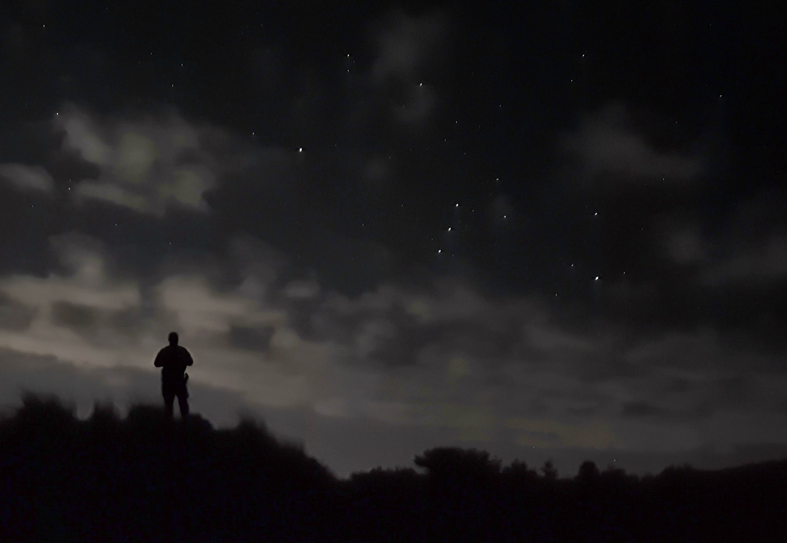
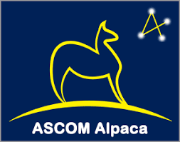
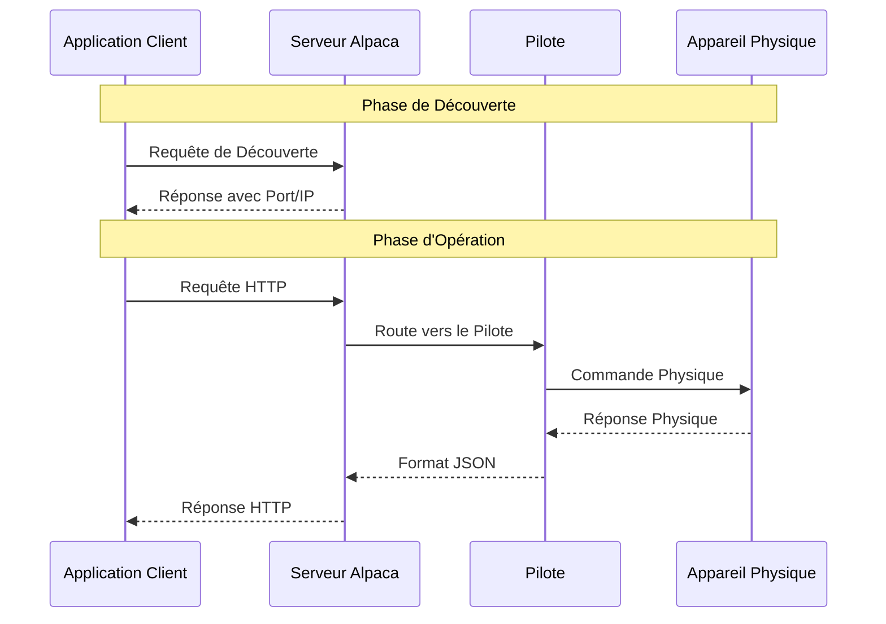
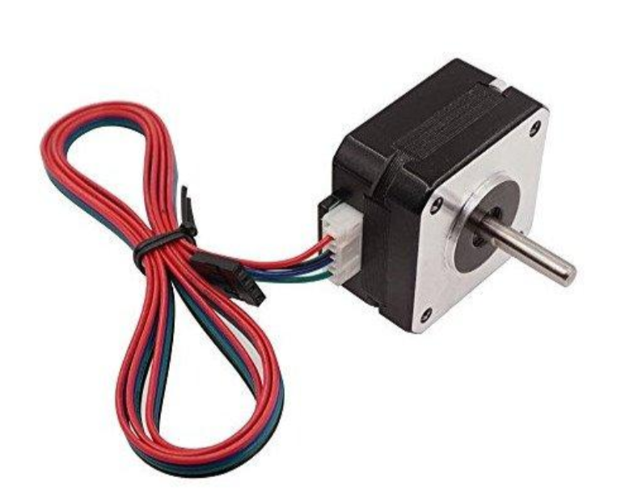
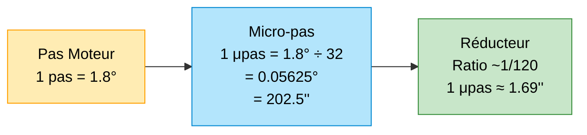
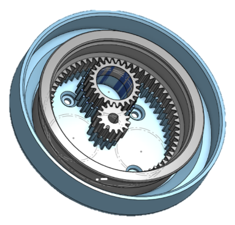

# Starget : Conception d'une monture astronomique
Ayant découvert l'astronomie, en tant qu'étudiant il y a quelques années, j'ai toujours été confronté aux limitations liées au budget. Débutant, mes exigences concernant les performances de mon matériel sont limitées. Ajoutant à cela mes études d'ingénieur et les compétences qui en découlent, **il est tout naturel que je me sois tourné vers le DIY pour renforcer mon équipement.**

Pour mieux comprendre la portée et le contexte du projet, il serait peut-être bien que je me présente :  Je suis **Sylvain BROCAS**, **élève ingénieur à l'École Centrale de Lyon** et passionné de sciences et de techniques. **Touche à tout**, je suis toujours à la recherche de nouvelles compétences et de nouveaux défis, en particulier de projets mêlant **mécanique, électronique et programmation**. 
**Converti à la fabuleuse passion qu'est l'astronomie en arrivant dans mon école, je me suis rapidement tourné vers l'astrophotographie. Le but de mes sessions d'observation nocturne consiste donc à repartir avec une image qui me satisfait**. Au début de l'année 2024, j'étais déjà équipé avec un télescope (Un Arcane N180/1080 pour les connaisseurs), matériel performant mais lourd et encombrant. J'ai donc investit dans une monture plus légère, une [Star Adventurer](http://skywatcher.com/product/star-adventurer/) de chez SkyWatcher. C'est une bonne petite monture, motorisée sur un axe, et fiable… maiiss il me manquait un petit quelque chose.

     
		<i>Votre serviteur sous la constellation d'Orion</i>

Pour ceux qui ne sont pas familiers avec ces termes techniques, voici un petit rappel :
- **L'astrophotographie** est une technique photographique qui consiste à prendre des photos du ciel nocturne, en particulier des étoiles et des planètes. Ce genre de photo demande de longs temps de pose (quelques secondes a plusieurs minutes pour 1 photo), ce qui nécessite un dispositif de suivi assez rapidement.
- **Une monture** est un support qui permet de maintenir un télescope ou un appareil photo en mouvement, de manière à compenser la rotation de la Terre et permettre ces longs temps de pose. Elle peut être motorisée pour automatiser le suivi.
- **Une monture Équatoriale** est un type de monture qui permet, après un phase de réglage (mise en station), de suivre un objet céleste en compensant la rotation de la Terre en utilisant un seul axe de rotation.
- **Un APN** est un Appareil Photo Numérique, un appareil photo classique type Reflex ou Hybride.

**Ce que j'attends d'une monture comme la Star Adventurer, c'est de la portabilité, de la légèreté et un minimum de performances.** Cependant, je trouve que pour son poids, elle ne permet pas de porter un gros ensemble optique, elle est trop lourde pour des petits trépieds légers comme un étudiant dans mon cas est capable de se payer. La mise en station peut être difficile parce que le montage est sensible aux vibrations… et les performances de la monture dépendent fortement de la qualité de la mise en station. Rajoutons a cela qu'elle ne dispose pas de pointage automatique, **cette monture est bonne, mais elle peut parfois se révéler fastidieuse à utiliser.**

Sa grande sœur, la [Star Adventurer GTi](http://www.skywatcher.com/product/star-adventurer-gti/) réponds à quelques problématiques mais coûte près de deux fois plus cher. J'ai donc décidé de me lancer dans la conception d'une monture équatoriale motorisée, qui répondrait à mes besoins et à mes contraintes. Je l'ai appelée **Starget**, contraction de Star et Target… je trouvais que ça matchait plutôt bien. 

> Mon objectif n'est pas de réinventer la roue ou de concurrencer les géants de l'astronomie, mais plutôt de concevoir une monture orientée vers l'ultra portabilité. Une monture assez spécialisée donc, dont le cadre d'utilisation se restreint principalement à de l'astrophotographie à l'APN, avec un objectif ou téléobjectif, avec un dispositif léger et robuste, qu'on peut facilement glisser dans un sac de voyage sans avoir à payer des bagages en plus.

Vous l'aurez compris, dans ce projet, les gros défis vont reposer dans l'optimisation du poids, de l'ergonomie et bien sûr du prix final du dispositif. Mais ce n'est pas tout! Une monture c'est également un assemblage de pièces mécaniques qui n'existent que dans mon esprit, de composants électroniques qu'il va falloir assembler intelligemment, programmer afin d'obtenir un Tout fonctionnel.

**Je vous laisse plonger dans cette aventure avec moi, dans cet article, je vais vous amener avec moi dans la jungle que représente un tel projet. Sachez que je partage également régulièrement des nouvelles du projet sur notre [serveur discord](https://discord.com/invite/339KvZDSf7).**
## Avant-propos 
Comme dans tout projet, la première chose à faire, c'est de saisir un stylo, un papier (dans mon cas, un carnet entier ^^) et de poser au calme nos idées : 

Qu'est-ce que je veux faire ? *Une monture astronomique*. Très bien, mais qu'a-t-elle de spécial cette monture ? *Elle est très légère, on peut le mettre dans son sac sans la casser, et ah, on peut l'alimenter avec une batterie externe… vu qu'on va l'utiliser dans les champs, à la montagne, … Mais, au fait, existe-t-il déjà des montures similaires ? J'ai entendu parler d'Onstep par exemple.

> [Onstep](https://onstep.groups.io/g/main/wiki) est un projet Open Source qui permet de motoriser une monture astronomique facilement avec un microcontrôleur et des drivers de moteurs pas-à-pas. C'est une solution très économique et très performante, mais assez mal documentée si l'on sort des compositions classiques.

*Oui, effectivement, Onstep est une bonne solution à mon problème, ça m'évite d'avoir à recoder un logiciel complet, ça m'aide à choisir les composants électroniques...reste plus qu'à développer la mécanique, et ça tombe bien, c'est ce que je préfère !*

**Mais ce serait passer à côté d'un aspect très important de ce projet :** je le vois comme un projet d'application, d'apprentissage. Je vais beaucoup bouger pendant la fin de mes études, j'ai déjà du matériel à la maison… Avoir cette monture entre les mains n'est pas urgent à mes yeux. Prendre le temps d'apprendre de nouvelles compétences, me mettre au défi, partager des ressources avec internet, en particulier des ressources francophones qui peuvent manquer parfois… **C'est là mon véritable objectif derrière ce projet.**

> En découvrant le projet, vous vous ferez peut-être parfois la réflexion que je fouille trop certains points, que je m'attache à des solutions qui ne permettent pas de faire avancer le projet, mais gardez à l'esprit que j'y trouve sûrement un intérêt, que j'éprouve de la curiosité à ce sujet. **N'hésitez en revanche pas à partager votre avis sur le projet, à me poser des questions, à me donner des conseils. La meilleure solution vient souvent des remarques les plus anodines.**

## Étape 1 : Structurer le projet
Il est temps de passer pour de vrai au projet. Dans cet article, je vais rester assez général. D'autres articles viendrons pour expliquer en détail certains points techniques. Je vais aujourd'hui me contenter d'expliquer les grandes lignes du projet, les grandes étapes que je vais suivre pour arriver à mes fins.

> **Une revue de projet sera justement (ou a été) diffusée sur notre [chaîne Twitch](http://www.twitch.tv/eos_projets)  le Samedi 1er Mars 2025 pour présenter le projet et l'étudier un peu plus en profondeur.**

### 1.1 : Cahier des charges
Le cahier des charges de ce projet va rester assez simple et général, dans la mesure où il va évoluer au fur et à mesure des mes découvertes. En effet, bien que déjà expérimenté en programmation, en conception, **développer une monture est quelque chose d'assez particulier**, je n'ai pas vraiment d'expérience dans ce domaine, il m'a fallu plusieurs mois d'explorations pour comprendre comment était structurée une monture, quels étaient les composants comme les moteurs adaptés à cette application, quels outils existent déjà pour me faciliter la tâche sans tout réinventer.

| Critère                 | Description                                                                                       |
| ----------------------- | ------------------------------------------------------------------------------------------------- |
| Charge utile            | Supporter un APN avec des objectifs jusqu'à 300 mm de focale, pour une charge totale de 2 à 3 kg. |
| Portabilité             | Conception légère et compacte, adaptée au transport dans un sac à dos standard.                   |
| Consommation électrique | Faible, adaptée aux sorties sur le terrain.                                                       |
| Contrôle                | Pilotage via un PC utilisant le logiciel d'astrophotographie NINA.                                |
| Fabrication             | Moyens de fabrication accessibles (Fablab et matériel personnel).                                 |
**Pour synthétiser, je veux me placer au niveau de performances équivalent à celui d'une Star Adventurer, mais avec une structure plus légère et le support du GOTO, à destination d'une utilisation comme setup ultraportable.**

### 1.2 : Planification

Je vois ce projet comme un **projet à moyen terme**, organisé en plusieurs étapes :

1. **Recherche et documentation :** C'est ce que j'ai fait pendant plusieurs mois. J'ai lu des articles, des forums, des documentations techniques, essayé des prototypes, j'ai regardé des vidéos, des tutoriels… Cette étape est cruciale pour pouvoir placer le curseur au bon endroit entre créer et réutiliser. *Trop d'invention, c'est trop de travail, et c'est risquer l'abandon, pas assez, ce serait passer à côté des mes objectifs.*
2. **Conception d'un premier prototype :** Cette version de la monture devra répondre au strict minimum des mes exigences *(A savoir, la motorisation et le pointage sur les deux axes de la monture, et les critères de performance dans le pire des cas de chargement)***
3. **Test et validation du prototype :** Cette étape est cruciale pour valider les choix de conception, les choix de composants, et les choix de programmation. C'est aussi l'occasion de valider les performances de la monture. À partir de ce stade, le projet prends une autre tournure. On a un système fonctionnel, et on peut maintenant s'amuser à le pousser, en ajoutant des fonctionnalités, en optimisant sa conception, en corrigeant surtout les problèmes de la première version.
4. **Finalisation du projet :** Cette étape est encore lointaine aujourd'hui. Ce projet a vocation aujourd'hui à rester ouvert. Il faudra adjoindre aux fichiers sources de la documentation, peut-être vendrai je également des kits prémontés … Il me faudra préciser cela au cours du projet, en fonction de mon avancement et de l'intérêt que le projet suscite.

## Étape 2 : Comment on conçoit une monture ?
### 2.1 : La structure
Pour bien concevoir une monture, il faut d'abord comprendre comment elle fonctionne et ce qui la compose. Basiquement, quelque soit son architecture, une monture ce sont deux axes orthogonaux qui permettent de balayer toute la voûte céleste, et qui, dans notre cas, seront motorisés. Les moteurs, mais aussi les éventuels capteurs, connecteurs, ... seront gérés automatiquement par une carte électronique, un genre d'unité centrale.

Je ne rentrerai pas dans le détail de toutes les architectures physiques de monture qui existent, je vous laisse un petit lien vers une une ressource assez exhaustive sur le sujet [ici](http://serge.bertorello.free.fr/optique/montures/montures.html). Sachez simplement que j'ai choisis une architecture de monture équatoriale.

### 2.2 : Utilisation d'une monture
Une monture s'utilise de la manière suivante : 
    - **Installation du matériel :** On place la monture sur son trépied, on la charge avec notre ensemble optique.
    - **Mise en station (Si monture équatoriale) :** Sur certaines montures (dont Starget), il faut  aligner un axe de la monture avec la rotation de la Terre à travers une opération appelée mise en station.
    - **Connecter la monture à un élément de contrôle :** Ce dernier, une fois connecté à la monture lui enverra les instructions et lui demandera son état (position, est-ce qu'elle bouge, …). L'unité centrale doit ensuite convertir ces instructions "haut niveau" en instructions "bas niveau" pour les moteurs, les capteurs, …
    - **Initialisation :** Après une éventuelle phase d'initialisation pour synchroniser la monture et le logiciel de contrôle, la monture est utilisable.
    
> En règle générale, l'élément de contrôle est un logiciel PC, mais il peut aussi s'agir d'une application mobile ou d'une télécommande. Dans notre cas, le premier prototype sera pensé pour fonctionner avec le logiciel [NINA](https://nighttime-imaging.eu/), très répandu dans le monde de l'astrophotographie.

### 2.3 : La connexion avec l'élément de contrôle
Pour connecter la monture à l'élément de contrôle, il faut choisir un **protocole de communication**. Il en existe plusieurs dédiés à l'astronomie et supportés par quasiment tous les logiciels de contrôle de monture, j'ai choisis de travailler avec une solution qui s'appelle **Alpaca, développé par ASCOM**, grand nom du domaine.

     
		<i>Logo du protocole Alpaca</i>

Alpaca est un protocole de communication qui permet de contrôler des équipements astronomiques à distance, via par exemple un réseau local, mais a aussi la particularité d'être multiplateforme. Cela signifie que le driver de la monture pourra être utilisé depuis un PC Windows, Linux, un smartphone sans avoir à réécrire le code pour chaque plateforme.

**Voici comment fonctionne Alpaca** : Pour construire le driver qui permettra la communication entre l'élément de contrôle et la monture, il faut développer un driver *Client* côté contrôle, et un driver *Device* côté monture qui respectivement enverront et recevront les instruction. Le driver *Client* est déjà implémenté dans la plupart des logiciels astro, c'est quelque chose que je n'aurai pas à faire. Il me reste tout de même à développer le bout de code qui transformera des messages standardisés et les **paramètres**** associés à la commande en une action physique de la monture (mouvement, lecture de la position, …)

Le diagramme suivant précise le parcours communications au sein d'un driver Alpaca :

> Un driver Alpaca est en fait tout simplement une API que l'on peut construire dans n'importe quel langage tant qu'on peut créer un réseau entre l'élément de contrôle et la monture (Dans mon cas, je pense au Wifi).

Pour construire ce programme, je ne pars pas de rien puisque ASCOM a publié il y a quelques mois des [templates](https://github.com/ASCOMInitiative/AlpycaDevice) avec un exemple. Bon… l'exemple porte sur un Device de type rotateur, une machine qui tourne sur un axe, c'est loin d'être aussi complet qu'un télescope mais je ne vais pas cracher dessus.

> L'un de mes objectifs secondaires dans ce projet sera de publier mes templates pour développer un driver de télescope pour aider la communauté.

**Starget sera donc pilotable par un driver ASCOM Alpaca.**
## Étape 3 : Choix technologiques
Maintenant qu'on a choisis l'architecture de Starget ainsi que le protocole de communication pour s'y connecter, il est possible de se pencher sur la suite. Voici comment je prévois de procéder :
1. **Coder les fonctions haut niveau du driver Alpaca :** Sans driver, il n'y a pas de contrôle donc pas de monture. Il est logique de commencer par là. Par fonction haut niveau, j'entends la structure d'API en elle-même : récupération des requête, parsing des paramètres, gestion des erreurs etc...
2. **Concevoir l'ensemble électronique :** Une fois qu'on a la première couche, il faut encore arrêter les choix de capteurs, de moteurs, … et coder les fonctions bas niveau qui seront appelées par le driver pour exécuter les actions de la monture
3. **Concevoir la mécanique :** Une fois qu'on a à la fois un logiciel et un circuit électronique fonctionnels, on peut s'affairer à rentrer tout ça dans une carcasse pour obtenir le produit final.

> Ces trois phases ont été explorées dans les derniers mois, et des premières idées de solution voire des prototypes ont déjà émergé, je parle ici du développement effectif de la solution finale

**La suite de cet article porte sur la présentation des choix technologiques actuels et leur justification.**

### 3.1 : La motorisation
On l'a dit plus haut… pour bouger, la monture a besoin de moteurs. On va s'intéresser ici au choix de ce composant.

Première question à se poser : *Qu'est-ce qui existe comme type de moteur (abordables étant donné mes contraintes) ?* Deuxième question : *Qu'est-ce qui se fait sur les autres montures ?*

Au niveau des moteurs, 3 technologies ressortent particulièrement :

| Caractéristique / Characteristic | Moteur à Broches / Brushed Motor | Moteur Sans Broches / Brushless Motor | Moteur Pas à Pas / Stepper Motor |
| --- | --- | --- | --- |
| Avantages | • Coût réduit • Contrôle simple • Relation linéaire couple-vitesse | • Plus efficace • Durée de vie plus longue • Moins d'interférences électromagnétiques | • Positionnement précis • Maintien de charge • Fiabilité élevée |
| Inconvénients | • Usure des balais • Interférences électromagnétiques • Entretien régulier requis | • Coût initial plus élevé • Système de contrôle complexe | • Moins efficace en continu • Torque diminué à haute vitesse |
| Applications typiques | • Équipements automobiles • Appareils électroménagers • Jouets | • Véhicules électriques • Machines industrielles • Produits de consommation | • Machines CNC • Imprimantes 3D • Robots industriels |
| Caractéristiques techniques| • Relation linéaire couple-vitesse • Facilement contrôlable • Simple à mettre en œuvre | • Haute efficacité énergétique • Faible friction interne • Longue durée de vie | • Pas précis et répétable • Positionnement exact • Couple élevé à basse vitesse |

La grande différence entre les moteurs brushed/brushless et les pas à pas réside principalement dans leur mode de commande. Les premiers se commandent en vitesse : en fonction de la tension "lue" à leur borne, un couple provoque la rotation du rotor qui se stabilise à une certaine vitesse. Dans le cas du moteur pas à pas, le rotor est composé d'aimants et le stator de bobines. Si une bobine est activée, le rotor va se placer en face des pôles attractifs. En alimentant astucieusement les bobines, on peut faire tourner le champs magnétique et le moteur va le suivre. Les fameux *pas* du moteur sont toutes ces positions d'équilibre en face des bobines. **Cette grande différence entre les technos a une grande conséquence : Les moteurs brushed/brushless se commandent naturellement en vitesse alors qu'un moteur pas à pas permet de se commander en position.**

Reprenons un peu de recul sur notre projet, et demandons nous quels mouvements devra réaliser Starget. On peut distinguer deux mouvements principaux :
- **Le Tracking :** La monture doit suivre la rotation de la Terre. Ce suivi est réalisé par la rotation en continu d'un axe *(Axe d'Ascension Droite)* à une vitesse de 15°/h environ. Il faut qu'il soit le plus lisse et continu possible pour assurer un bon suivi de l'objet
- **Le Slew :** C'est un grand mouvement (plusieurs degrés d'amplitude), à plus grande vitesse qui permet de pointer une direction, placer la monture dans sa position de *parking*, ...

> On notera que pour un Slew, la position d'arrivée est très importante (quelques degrés de différence peut faire manquer une cible)

On se rend compte que **le paramètre le plus important dans ces mouvements est la précision de positionnement et le contrôle sur la vitesse sur les faibles vitesses**. Pour cette application, le moteur pas à pas est tout indiqué … et utilisé sur un grand nombre de montures

> Après quelques recherches sur le sujet, on se rend compte qu'il est tout à fait possible, avec un circuit de contrôle en boucle fermée de piloter un moteur brushless en position avec une bonne précision. Le dispositif est un peu plus cher, même pour les solutions Open Sources déjà existantes. Mais un tel moteur pourrait laisser envisager un gain de poids et de place certain, ainsi qu'une diminution des vibrations par rapport à un moteur pas à pas. Cela viendra peut être dans une version future de Starget.

**Starget sera donc dotée de moteurs pas à pas dans sa première version. Après réflexion, j'ai décidé d'opter pour ce [driver](https://github.com/makerbase-mks/MKS-SERVO42C) en boucle fermée. il offre plusieurs options intéressantes :**
- **Commandes en UART : On envoie des commandes par liaison série, le driver se charge de l'exécution de son côté, sans bloquer le reste du programme de la monture**
- **La plateforme est bien documentée**
- **La carte prends très peu de place et est très légère...tout ce que je recherche**

Utiliser ce driver assez évolué me permet de m'éliminer beaucoup de travail du côté motorisation, ce qui est une bonne chose.

> Je tiens à mettre en avant l'[initiative suivante](https://creapunk.com/) : C'est un gars qui développe tout seul son propre driver pour un coût de revient très faible tout en préservant beaucoup d'options intéressantes et de bonnes performances. Le projet est en cours, il a déjà sorti plusieurs versions de son PCB et son software, mais par exemple, l'API de contrôle par port série n'est pas encore implémentée, ainsi que d'autres options de base. Si vous êtes compétents dans le domaine ou tout simplement curieux, essayez de contribuer à son projet, ou simplement lui faire un petit coucou sur son serveur [Discord](https://discord.com/invite/D4EkKaf5vV)

**Pour conclure cette section, j'ai choisis le [moteur suivant](https://www.laskakit.cz/user/related_files/73231_1624__ps_1199sm-17hs4023-etc.pdf) pour les deux axes de la monture :** 

	

### 3.2 : L'unité centrale
Pour traiter les instruction, activer les moteurs et lire les capteurs, il nous faut un cerveau, une unité de calcul. Pour sa puissance raisonnable, sa faible consommation et très faible encombrement, j'avais démarré ce projet avec un devkit ESP32 programmé en micropython. Cela permettait d'allier ma connaissance en python, la facilité de développement en conservant un support physique minimal. J'avais réussi à écrire un driver capable de se connecter à NINA (rappelez vous, c'est le logiciel de contrôle) sur la base de [ce projet](https://github.com/RunTJoe/MiPyAlpaca). Mais je suis finalement tombé sur les templates d'ASCOM, disponibles en python, mais pas en version micropython. Certaines idées de futures implémentations auxquelles je pense pour un stade bien plus avancé du projet m'ont poussé à me tourner finalement vers un Raspberry Pi. **J'ai choisis le modèle qui semble le plus adapté à mes besoins et mes contraintes : Le [Raspberry Pi Zero 2 W](https://datasheets.raspberrypi.com/rpizero2/raspberry-pi-zero-2-w-product-brief.pdf)**

Cette carte sera programmée en python. On peut y adjoindre des modules pour capter le signal GPS, des modules RTC pour garder l'heure en mémoire même hors tension, qui permettraient d'ajouter des fonctions pratiques pour Starget. La carte dispose également d'un port de communication UART qui permettra de contrôler entre autres choses les moteurs. Il y a également suffisamment d'entrées/sorties pour y brancher les capteurs qui équiperont la monture.

### 3.3 : La mécanique
Globalement, hormis un premier [modèle](https://cad.onshape.com/documents/c2a5d542c837fbf3e9a01f71/w/1fb0c1fdcb5c093b99c6adb8/e/1e525a6464b6294251420b4a) issu de ma phase d'exploration, la mécanique n'est pas très avancée. J'ai pu, au cours de cette première phase déterminer que je devrais pouvoir faire tenir le corps de la monture dans un pavé de 10x10x15 cm, ce qui est une bonne base.

Au cours de cette phase, je me suis rendu compte que j'aurai surement besoin d'un réducteur à placer en sortie des moteurs afin d'améliorer leur résolution angulaire, et augmenter le couple. 

> Voici le détail de mes calculs. Si vous avez des suggestions, des remarques à apporter vis-à-vis de cette section, je vous invite encore une fois à m'en faire part, que ce soit sur discord d'Eos, LinkedIn,...

Prenons un cas limite : un objectif de 200mm sur un Reflex. Je prends exemple sur mon Canon 40D qui possède un capteur avec des pixels assez gros de 5.71 μm de côté et qui est assez lourd en comparaison des APN modernes. L'ensemble pèse de 1.5 à 2.5kg. Prenons 3.5 kg de charge utile pour être large.

Pour estimer mon besoin de précision sur le suivi, voici mon raisonnement :
- Résolution moteur : 1.8°/step ou 0.9°/step (J'ai acheté des 1.8°/step)
- Facteur de [microstepping](https://www.linearmotiontips.com/microstepping-basics/) : 0 à 256 
- Focale : 200 mm ==> Focale effective : 320 mm (Prise en compte du [facteur de crop](https://neelnajaproduction.com/ce-quil-faut-savoir-sur-les-capteurs-et-crops-factors/))
- Taille pixel : 5.71 μm

[Echantillonnage](https://www.univers-astro.fr/fr/content/6-le-calcul-d-echantillonnage) :  
$$
e = 206 \times \frac{5.71\ \mu m}{320\ mm} = 3.68''\text{/px}
$$

Un pixel couvre donc 3.68" d'arc dans cette configuration. Je veux que l'angle correspondant à un pas soit plus faible que cette valeur pour pouvoir suivre finement le ciel sans décalage entre les images. Si l'on se base sur le critère de Shannon, on devrait avoir un pas au moins deux fois plus fin que la résolution d'un pixel.

D'après mes recherches, il ressort que le facteur de **microstepping** maximum utilisable en pratique pour ce genre d'application est de 32. 

>Le microstepping est une technique de commande d'un moteur pas à pas qui permet de multiplier virtuellement le nombre de pas d'un moteur et donc améliorer sa résolution angulaire. Un facteur de 32 signifie qu'on multiplie le nombre de positions possibles par 32, et qu'on divise par autant sans résolution angulaire. Utiliser le plus gros facteur possible permet de réduire le coefficient de réduction du réducteur qui serait éventuellement nécessaire, et donc de simplifier sa conception.

Pour le moteur que j'ai sélectionné :

Si l'on reprends la situation considérée sous forme de schéma, voilà ce que ça peut donner sur les deux axes :
![[schema_telescope_param.svg]]
On pose:
- m = 3.5 kg (Charge utile, centre de gravité en G)
- OG = d ~ 20 cm (hypothèse de l'ordre de grandeur du bras de levier)
- r = 1:120 (Hypothèse sur l'ordre de grandeur du rapport du réducteur)

Le pire des cas est le couple demandé sur RA lorsque la monture est à l'horizontale et subit pleinement la pesanteur au bout de son bras de levier. On se base sur ce cas là, on prendra les deux moteurs identiques pour le premier prototype.

$$ 
\begin{matrix}
C_{RA} = d \times m\times g \\
C_{mot} = d \times m\times g \times r \\
AN : \\
C_{RA} = 6.8 Nm \\
C_{mot} = 0.057 Nm = 5.7 N.cm
\end{matrix}
$$
D'après sa [documentation](https://www.laskakit.cz/user/related_files/73231_1624__ps_1199sm-17hs4023-etc.pdf), le moteur sélectionner peut développer 14 N.cm de couple, ce qui est bien suffisant pour notre application.

On remarque donc qu'un rapport de réduction de 120 devrait suffire pour atteindre la performance que je vise avec le moteur sélectionné.

> Une question qui se posera notamment lorsque j'aborderai plus en profondeur la partie mécanique de la monture concerne le **backlash**, c'est à dire le jeu dans la transmission de puissance. En effet, un jeu est nécessaire pour permettre l'engrènement entre les différentes parties du réducteur, mais un jeu pourrait potentiellement facilement atteindre la minute d'Arc voire le degré (rappelons que je prévois d'utiliser des moyens de production accessible en Fablab : impression 3D, découpeuse Laser, …). À ce moment, l'erreur induite dépasserait largement cette valeur de quelques secondes et rendrait peut être superflu ce gros rapport de réduction. **Ce sera une partie importante de mon étude des performances mécaniques de ce projet**.

Le ratio calculé a une valeur très élevée, 120. Même les réducteurs de type *harmonic drive* qui sont réputés pour permettre de gros ratios d'entraînement montent difficilement aussi haut. Je pourrais très bien assembler plusieurs étages de réducteurs, mais c'est très encombrant. 

D'après mes recherches, deux solutions s'offrent à moi :
    - **Solution roue/vis sans fin:** C'est une solution classique sur les petites montures...comme la Star Adventurer. Un tel réducteur s'achète pour une trentaine d'euros sur Amazon (roue dentée et vis sans fin, sans roulements).
    - **Solution basée sur un Split Ring Compound Planetary Gear:** Ce genre de réducteur est assez peu connu, bien qu.il ait visiblement été utilisé régulièrement en automobile, pour des modèles de [formula Student](https://lup.lub.lu.se/luur/download?func=downloadFile&recordOId=9152714&fileOId=9152738), …

Pour le coup, la solution à base de vis sans fin semble s'imposer d'elle même : système connu, un coût pas trop élevé, déjà utilisé par d'autres systèmes, …
Mais encore une fois, je vois dans ce projet l'occasion de tester des choses, de comprendre comment ça marche ( la grande différence entre les deux solutions tient aussi dans mon niveau de compréhension du mécanisme ^^). Or, si il existe des articles scientifiques traitant principalement de design optimal de SRCPG (oui j'abrège, c'est long à écrire) ainsi que des modes propres du système, je n'ai pas trouvé beaucoup de ressources pour le rendre accessible au niveau bidouilleur. On trouve bien quelques vidéos et articles de blog très intéressants, en particulier [cette vidéo](https://www.youtube.com/watch?v=-VtbSvVxaFA) ainsi que le [repo Github](https://github.com/IdeaPropulsionSystems/CoolEpicyclicGearing) qui va avec, notamment parce qu'elle fait partie des ressources qui explique le mieux à la fois le mécanisme et les équations qui le régissent. Ensuite, il y a quelques posts Hackaday comme [celui-ci](https://hackaday.io/project/164732-mprt-modified-planetary-robotics-transmission) ou [celui-là](https://hackaday.io/project/196907-rr1-real-robot-one-revision-2/log/233687-1x-how-to-calculate-the-reduction-ratio-of-split-ring-planetary-gearbox) qui ont retenus mon attention.

     
		<i>Voici une vidéo du premier prototype de SRCPG que j'ai imprimé au début du projet pour tester le concept</i>

	 
	<i>Et voici sa modélisation CAO au cours de son élaboration</i>

>Un article viendra à l'avenir pour expliquer plus en détail le fonctionnement de ce type de réducteur et partager mon implémentation au sein de Starget.

**Par conséquent, pour des raisons de curiosité et de volonté d'en comprendre un peu plus sur ce mécanisme qui semble sous-coté, j'ai choisi de l'utiliser pour le premier prototype de Starget avec un coefficient de réduction de 1:120.** 
# Conclusion
Félicitation ! Vous êtes arrivé au bout du pavé, j'ai presque réussi à battre Erwan avec son [dernier article ](https://www.eos-projets.fr/projects/application-flots-partie-1) ^^.

Nous avons survolé l'ensemble du projet, j'espère que vous aurez bien saisi comment je l'avais organisé. À l'avenir, des nouvelles sur le projet seront postées sur notre serveur Discord, des articles plus spécifique sur le réducteur, ou encore Alpaca verront le jour également. 
Je serai friand de tout retour et avis, que ce soit sur l'organisation, les outils utilisés, des incohérences de raisonnement…

Merci à la Team Eos qui m'a aidé à améliorer cet article.
